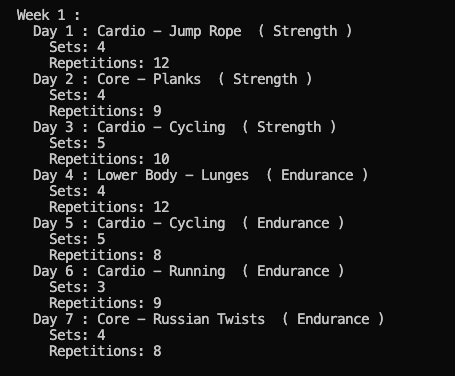

# Awesome Exercise App

Welcome to the R-Exercise-App! This R script is your personal fitness companion, designed to generate dynamic and personalized weekly workout routines for an entire month. 🏋️‍♂️💪

## Overview

The app boasts a rich selection of exercises, meticulously curated to target various muscle groups. It delivers a well-balanced blend of strength and cardio workouts, ensuring a comprehensive and effective fitness regimen.

## Features

- **Dynamic Workouts:** Experience the excitement of diverse and ever-changing workouts. The app intelligently generates routines, keeping your fitness journey engaging and results-driven.

- **Customization:** Tailor your workouts to fit your unique fitness goals. Easily customize exercises, sets, and repetitions to match your preferences and desired intensity.

## How to Use

**Run the Script.**
   - Execute the script to generate your personalized workout routine for each week.

 **View Your Generated Workout Routine.**
   - Explore the details of your weekly workouts directly within the R environment.

## Demo Video

Curious to see the app in action? Watch the demo video to get a sneak peek into the exciting world of Awesome Exercise App.

## Customization

Feel empowered to make the app truly yours by tweaking the code. Add or remove exercises, adjust the seed for different workout routines, and fine-tune the app to align with your evolving fitness journey.

## Issues and Contributions

Your contributions are valued!

## License

This project operates under the MIT License - see the [LICENSE.md](LICENSE.md) file for the full details.

---

Happy exercising! 💪🚀
